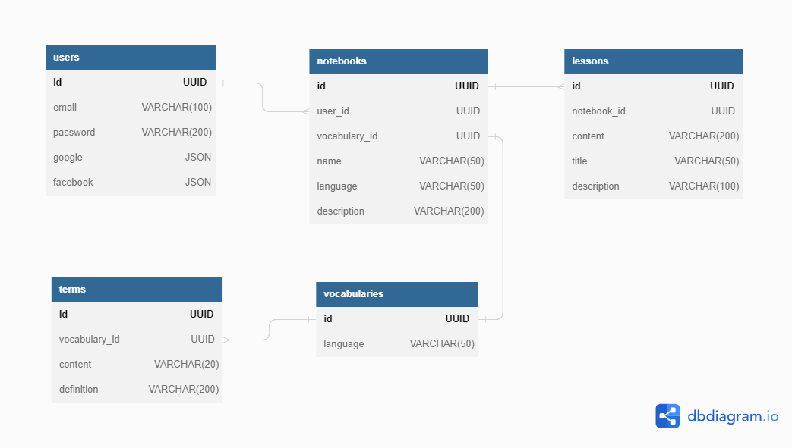

# LangNotes

LangNotes is a web app that helps the user to learn a new language, allowing him to store notes and vocabularies all in one place. This application is build with software PERN stack:

- [PostgreSQL](https://www.postgresql.org/) v12
- [Express JS](https://expressjs.com/) v4.18.1
- [React Framework](https://reactjs.org/) v18.2.0
- [Node JS](https://nodejs.org/en/) v16.15.1

This project was never meant for distribution and it has been build on the sole purpose to showcase my knowledge and skills in writing web applications.

## Installation
To install dependancies, run `npm install` both in server and in client folders.

This project requires a [PostgreSQL](https://www.postgresql.org/) v12 database to be running locally. Reference the following diagram that represents table relations and run the SQL commands located in file `/server/resources/db_setup_sql`.

This repo includes an `example.env` file that contains important environment variables for reference.  Make sure to create a `.env` file and include all variables found in the `example.env` file, replacing the example values with those specific to your environment/needs.

Make sure to setup the proxy port of the client application towards the correct back end URL. You can set it in `/client/src/setupProxy.js`.

## Running the application

Once the app is installed locally, you can start the server at `http://localhost:<your-port>` with the commands:

`cd server`
`node index.js`

You can start the React app on default port (3000) with the following commands:

`cd client`
`npm start`
